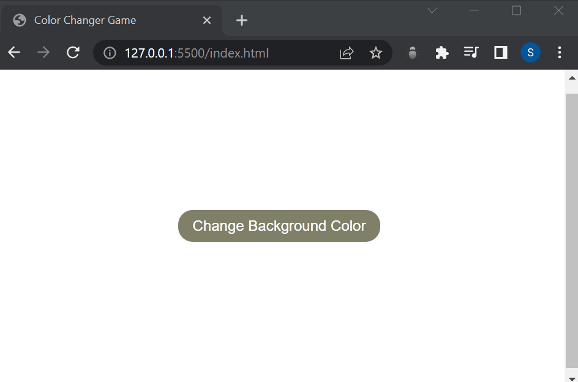

# Color Changer Game Page
> _by Saloni_

This webpage titled Color Changer Game made using HTML, CSS and JavaScript. This is a simple project where a button is provided in the middle of the screen, when pressed changes the background color of the whole screen in some random color.

 * ## Tech Stack

    
    
    
    
    

 * ## Knowledge Gained

   1. Creation of webpage using HTML, CSS and Javascript.

 * ## Output:

   